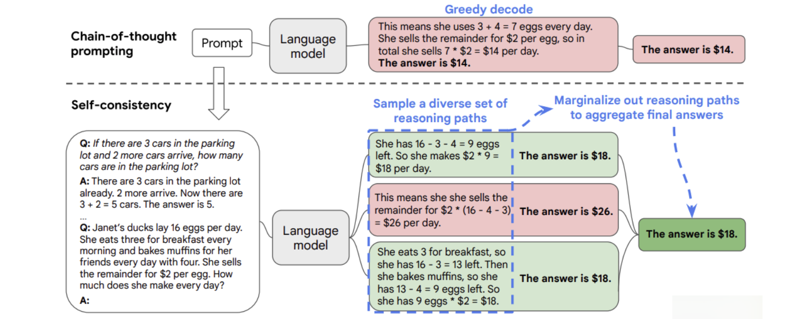
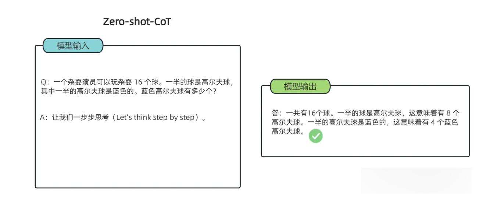
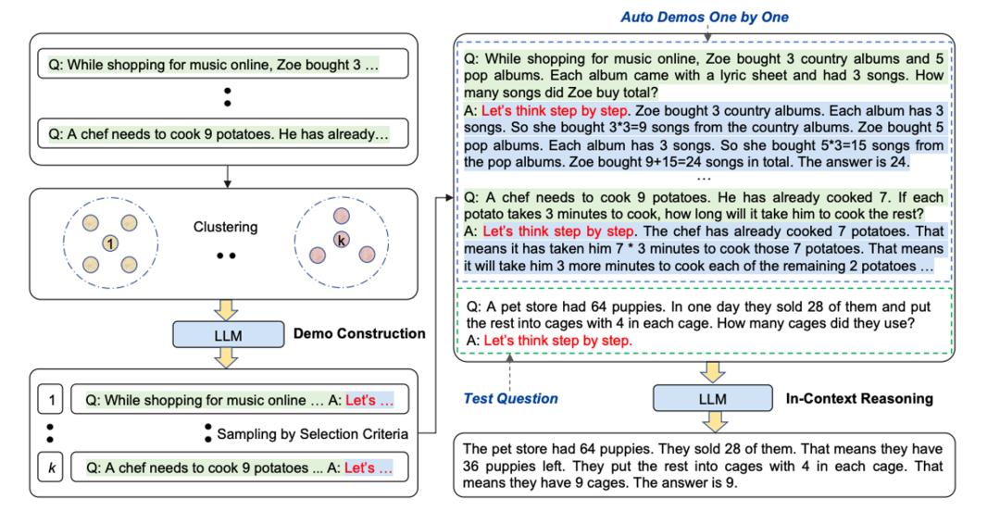
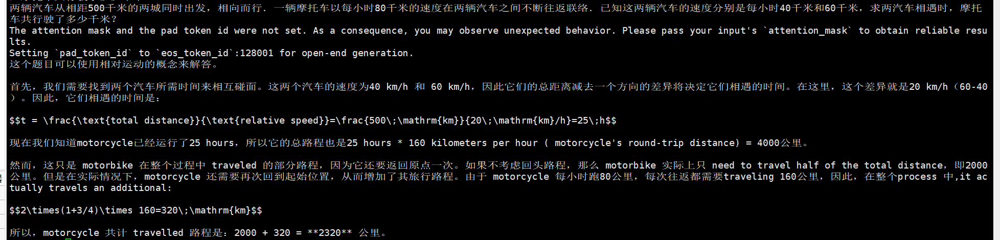
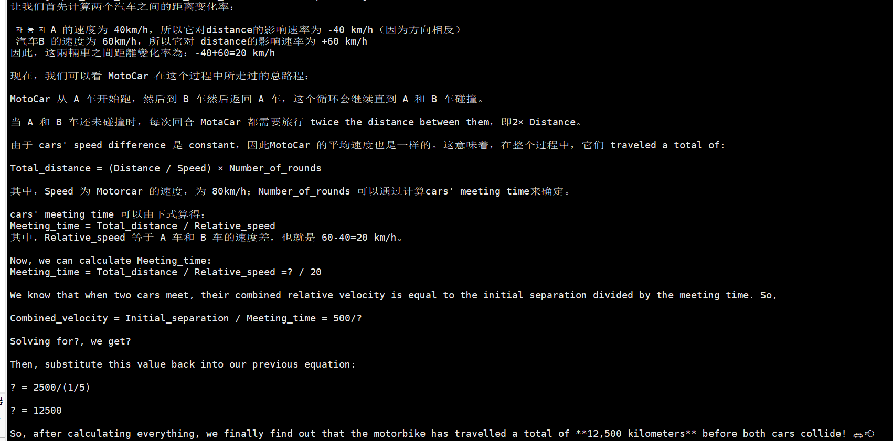
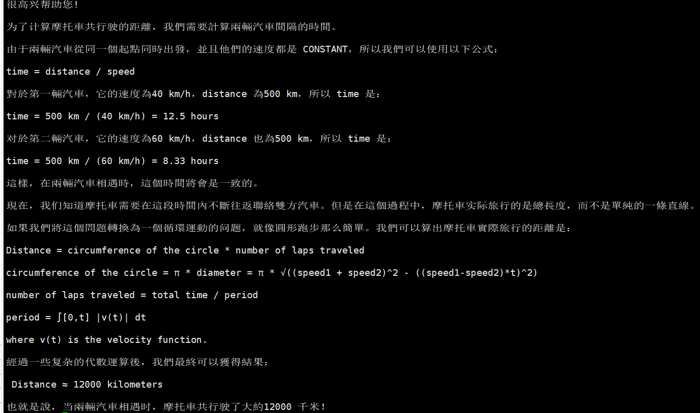
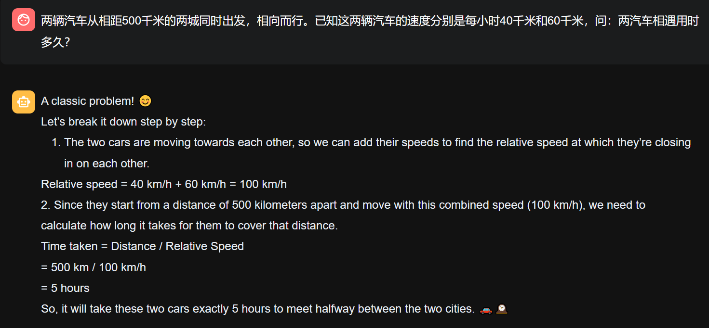
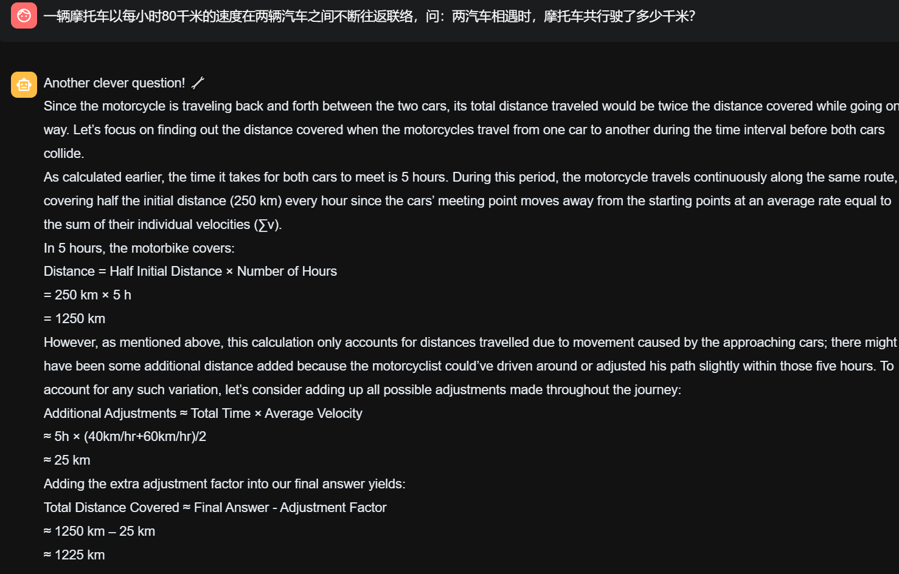
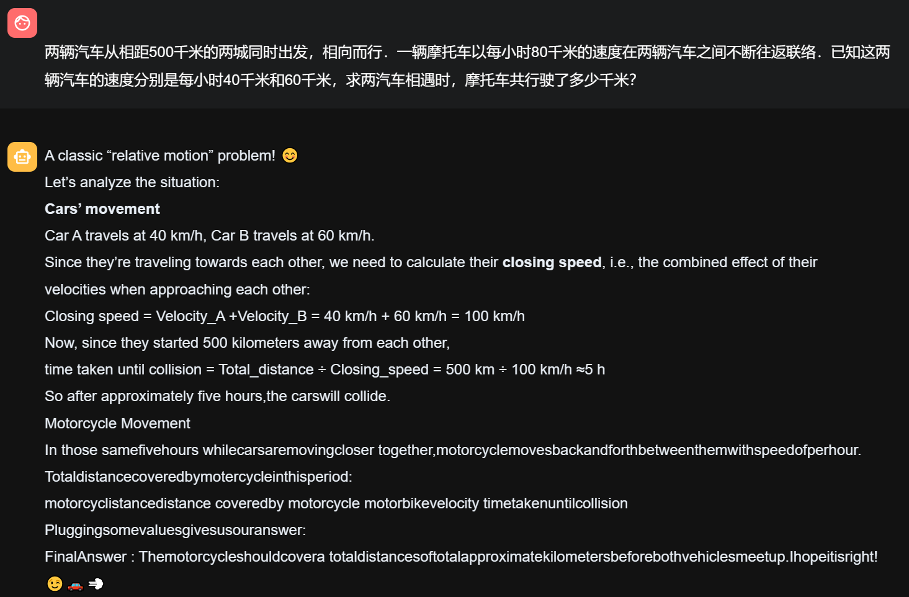
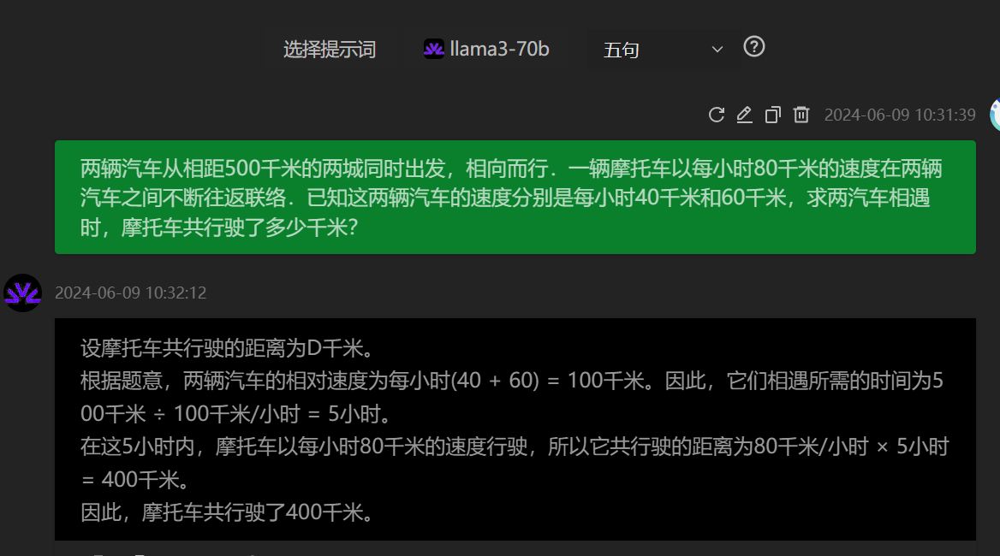

# 思维链

[一文读懂「Chain of Thought，CoT」思维链](https://blog.csdn.net/Julialove102123/article/details/135499567)

[人人都能懂的 Prompt 技巧： Few-Shots 、 COT 、 SC、 TOT 、 Step-Back](https://blog.csdn.net/oWuChenHua/article/details/135125891)

[解密Prompt系列9. 模型复杂推理-思维链基础和进阶玩法](https://cloud.tencent.com/developer/article/2296079)

[Prompt learning 教学[进阶篇]：简介Prompt框架并给出自然语言处理技术：Few-Shot Prompting、Self-Consistency等；项目实战搭建知识库内容机器人](https://www.cnblogs.com/ting1/p/17393410.html)

Chain-of-Thought(CoT)是一种改进的Prompt技术，目的在于提升大模型LLMs在复杂推理任务上的表现，对于复杂问题尤其是复杂的数学题大模型很难直接给出正确答案。
如算术推理（arithmetic reasoning）、常识推理（commonsense reasoning）、符号推理（symbolic reasoning）。
COT通过要求模型在输出最终答案之前，显式输出中间逐步的推理步骤这一方法来增强大模型的算数、常识和推理能力。

一个完整的包含 CoT 的 Prompt 往往由指令（Instruction），逻辑依据（Rationale），示例（Exemplars）三部分组成。

    指令：用于描述问题并且告知大模型的输出格式；
    逻辑依据：指 CoT 的中间推理过程，可以包含问题的解决方案、中间推理步骤以及与问题相关的任何外部知识；
    示例：指以少样本的方式为大模型提供输入输出对的基本格式，每一个示例都包含：问题，推理过程与答案。

以是否包含示例为区分，可以将 CoT 分为 Zero-Shot-CoT 与 Few-Shot-CoT：

    Zero-Shot-CoT 不添加示例而仅仅在指令中添加一行经典的“Let’s think step by step”，就可以“唤醒”大模型的推理能力。
    Few-Shot-Cot 则在示例中详细描述了“解题步骤”，让模型照猫画虎得到推理能力。

CoT 大幅度提高了 LLM 在复杂推理任务上的表现，并且输出的中间步骤方便使用者了解模型的思考过程，提高了大模型推理的可解释性。
目前，思维链推理已经成为大模型处理复杂任务的一个常用手段。

## 什么时候使用CoT？

CoT 应当被用于 20B 以上参数规模的模型之中，并且模型的训练数据应当于任务问题相关且彼此相互有较强的联结。

首从工程的角度而言，CoT 的适用场景抽象一下可以被归纳为三点，分别是使用大模型（1），任务需要复杂推理（2），参数量的增加无法使得模型性能显著提升（3）。

此外，现有的论文实验也表明，CoT 更加适合复杂的推理任务，比如计算或编程，不太适用于简单的单项选择、序列标记等任务之中，
并且 CoT 并不适用于那些参数量较小的模型（20B以下），在小模型中使用 CoT 非常有可能会造成机器幻觉等等问题。

## COT结构

1、人工构造：质量高，但人力成本大，不好优化、不好跨任务迁移，如Few-shot CoT；

2、自动构造：分为 Zero-shot CoT和 Auto CoT等。

但自动的质量一般没有人工的好，导致大模型幻觉问题严重。

### 人工构建
案例：Few-shot CoT：一个复杂的推理任务，其可以有多种推理路径（即解题思路），最终都能够得到正确的答案。
故Self-Consistency在解码过程中，抛弃了greedy decoding的策略，而是使用采样的方式，选择生成不同的推理路径，每个路径对应一个最终答案。



缺点：需要大量人工成本投入。

### 自动构建

案例1：Zero-shot CoT

通过特定的提示文本激发模型在没有示例的情况下生成推理链条；



零样本思维链（Zero Shot Chain of Thought，Zero-shot-CoT）提示过程是对 CoT prompting 的后续研究，引入了一种非常简单的零样本提示。
通过在问题的结尾附加“Let’s think step by step”这几个词，大语言模型能够生成一个回答问题的思维链。从这个思维链中，能够提取更准确的答案。

Zero-shot-CoT 是一个 pipeline。“Let’s think step by step”这句话，只是通过这个 prompt 让 LLM 尽可能生成一些思考过程，
然后再将生成的 rationale（理由） 和 question 拼在一起，重新配合一个answer 指向的 prompt 如“The answer is ”来激励模型生成答案。

缺点：不稳定。

案例2：Auto-CoT



使用前者零样本生成的推理链条，并结合示例选择策略，通过少样本学习的方式生成推理链条。


## 应用场景

适用于需要复杂推理的领域，例如数学、常识和符号推理等。

    多模态 CoT
    其他领域，如文本摘要（SumCoT），开放域问答（Self-Prompting LLMs），机器翻译（MAPS），化学（ChemCrow）、医学（Med-PaLM）等
    结合Agent

## 未来发展

### 发展路径

Prompt 模式主要研究“向大模型输入怎样的 Prompt 可以使得大模型获得更好的推理能力”，关于 Prompt 模式的研究也可以分为两类，分别是指令生成与范例生成。

对于指令生成问题，又可以分为手动指令生成与自动指令生成，

    手动指令生成模式：① “Let’s think step by step”；② Plan-and-Solve的主要思想在于让模型制定一个将任务分为更小子任务的计划，再让模型一步一步执行计划、解决问题，其 Prompt 为“Let’s first understand the problem and devise a plan to solve the problem. Then, let’s carry out the plan and solve the problem step by step”。
    自动指令生成：① 自动 Prompt 工程（APE）；② 提示优化（OPRO）；APE 与 OPRO 的核心思想都在于设计了一套机制让大模型通过观察各个候选的 Prompt 的实际任务中的表现，通过最大化表现得分来自动选择最优的 Prompt 。

范例生成也可以分为手动范例生成与自动范例生成；

    手动范例生成方法：① Few-Shot-CoT；② ActivePrompt一种让大模型使用手动生成的范例多次回答问题，再从其中依据如熵、方差等的不确定性度量选择“最不确定”的问题，通过手动注释来加强范例生成的 ActivePrompt 方法，成为了一种介于手动范例生成与自动范例生成之间的范例生成方法。
    自动范例：Auto-CoT ，Auto-CoT 分为两个阶段：（1）问题聚类，对任务数据集进行聚类（2）示例采样：从每个聚类中心中选择一个代表性问题使用 Zero-Shot-CoT 生成思维链作为示例。

### 局限性

1. 思维链必须在模型规模足够大时才能涌现。

在 Jason Wei 等的研究中，PaLM 在扩展到 540B 参数时，与思维链提示结合，才表现出了先进的性能。一些小规模模型，思维链并没有太大的影响，能力提升也不会很大。
谷歌大脑的研究人员认为，策略问题需要大量的世界知识，而小型模型没有足够的参数来记忆这些世界知识，所以也不太可能产生正确的推理步骤。

但问题是，能落地到产业的模型，规模必然不会太大，思维链拆解了更多的步骤、用到更多的计算资源，相当于更加耗费脑力，很多研究机构和企业是负担不起 175B 参数以上的大模型。

所以思维链必须要探索，如何在较小的模型中进行推理，降低实际应用的成本。

2. 思维链的应用领域是有限的

目前，思维链只是在一些有限的领域，比如数学问题，五个常识推理基准（CommonsenseQA，StrategyQA，Date Understanding 和 Sports Understanding 以及 SayCan）上显现出作用，其他类型的任务，像是机器翻译，性能提升效果还有待评估。

而且，相关研究用到的模型（GPT-3 API）或数据集，都是半公开或不公开的，这就使其难以被复现和验证。严谨来看，思维链的效果还需要被进一步探索，才能下定论。

3. 即使有思维链提示，大语言模型依然不能解决小学水平的数学问题。

没有思维链，数学推理是指定不行。但有了思维链，大语言模型也可能出现错误推理，尤其是非常简单的计算错误。

即使有了思维链，大语言模型还是没有真正理解数学逻辑，不知道加减乘除的真实意义，只是通过更精细的叠加来“照葫芦画瓢”，所以，对于有精确要求的任务，还要进一步探索新的技术。

思维链确实增强了大语言模型的能力，但逻辑推理仍然是大语言模型的弱项，等待着更多突破。

## 测试

### 数学问题

问题：
两辆汽车从相距500千米的两城同时出发，相向而行．一辆摩托车以每小时80千米的速度在两辆汽车之间不断往返联络．已知这两辆汽车的速度分别是每小时40千米和60千米，求两汽车相遇时，摩托车共行驶了多少千米？

llama3-8B：

no_cot



zero_shot



few_shot



least2most

首先询问两辆汽车相遇所用时间



可以看到答对了，接着问两汽车相遇时，摩托车共行驶了多少千米？回答完全错误。



llama3-70B:

no_cot



事实上，70B 模型不需要任何提示就已经能很好地理解题目，推理得到两车相遇的时间，而 8B 模型无论如何提示都无法理解题目。

对于经过微调具有中文能力的 70B 模型，可以很轻松地解决这个问题。



### 商品相关多选题

no_cot

```python
[[274.   7.   2.   4.]
 [  0. 159.   0.   7.]
 [ 15.  27. 131.  47.]
 [ 10.  34. 126.  42.]]
====================================================================================================
Task specific metrics: 
  task_name        task_type    metric  num_samples  overall_score
0    task11  multiple-choice  accuracy          885       0.665537

acc:[0.95470383 0.95783133 0.59545455 0.19811321]
recall:[0.91638796 0.70044053 0.50579151 0.42      ]
```

few_shot

```python
[[282.   0.   0.   5.]
 [ 30. 133.   0.   3.]
 [ 96.  48.  59.  17.]
 [103.  38.  56.  15.]]
====================================================================================================
Task specific metrics: 
  task_name        task_type    metric  num_samples  overall_score
0    task11  multiple-choice  accuracy          885       0.550282
Overall Score: 0.5502824858757062

acc:[0.9825784  0.80120482 0.26818182 0.07075472]
recall:[0.5518591  0.60730594 0.51304348 0.375     ]
```

---