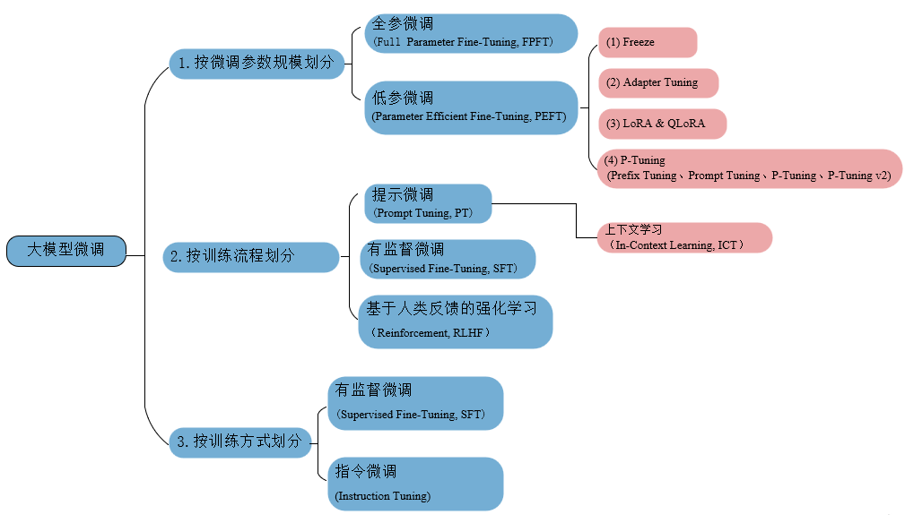
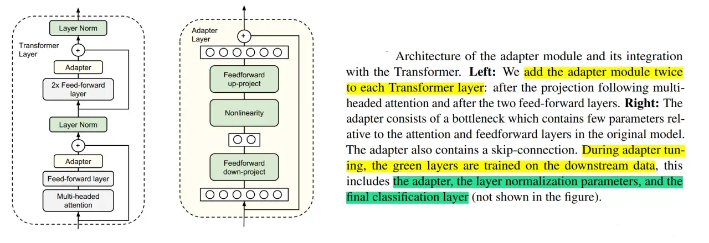
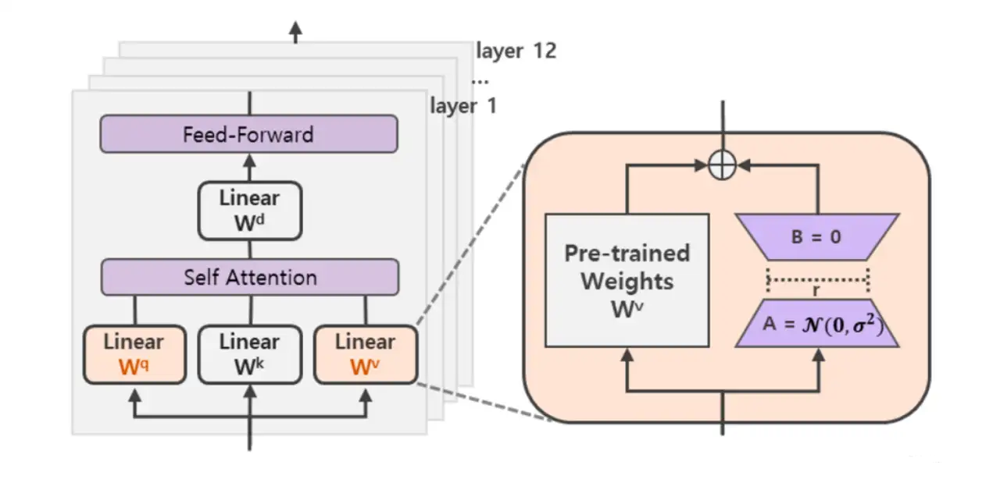
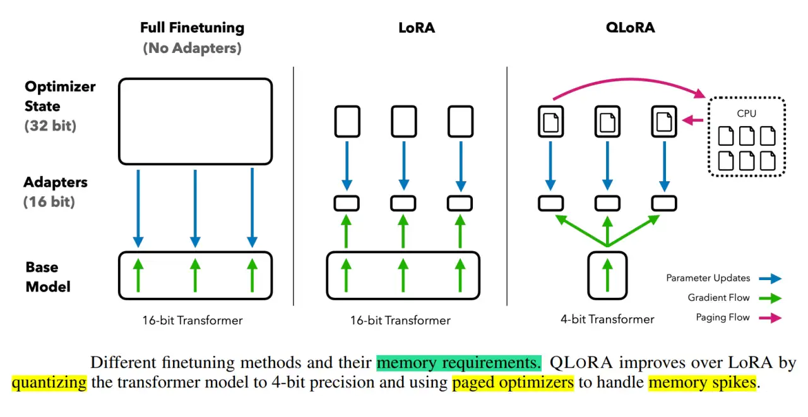
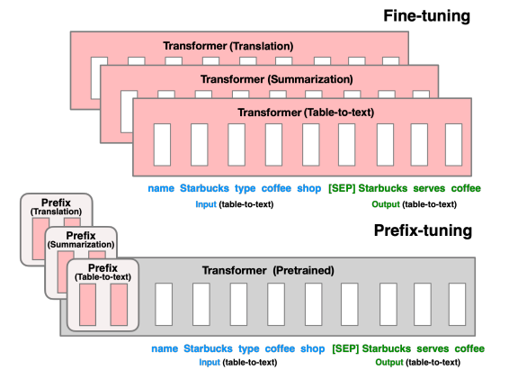
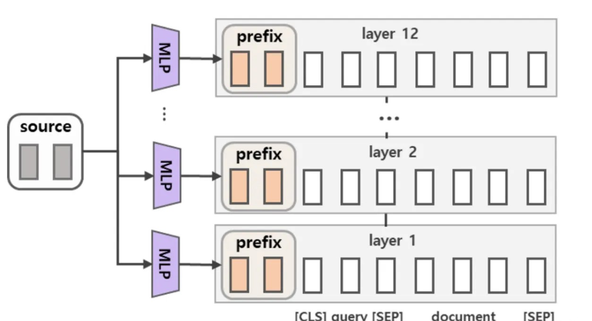
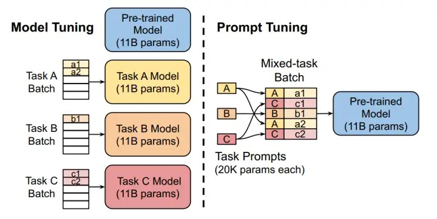
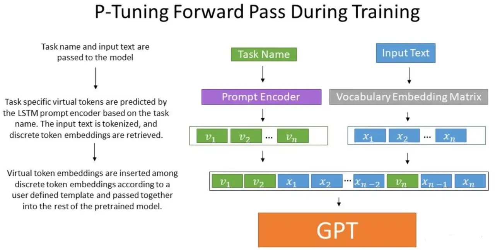
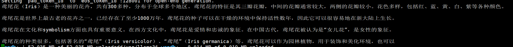
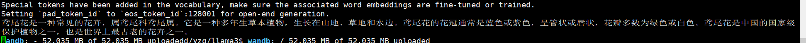

# fine tune



---

## 分类

### 按微调参数规模划分

#### 全参微调（Full Parameter Fine-Tuning，FPFT）

用预训练权重作为初始化权重，在特定数据集上继续训练，全部参数都更新。

#### 低参微调（Parameter Efficient Fine-Tuning，PEFT）

用更少的计算资源完成参数的更新，只更新部分参数，或者通过对参数进行某种结构化约束，例如稀疏化或低秩近似解来降低微调的参数量。
最小化微调网络模型中的参数数量和降低计算复杂度来提高预训练模型在新任务上的性能，从而缓解大型预训练模型的训练成本。
使得即使计算资源受限，也可以利用预训练模型的知识来迅速适应新任务，实现高效的迁移学习 Transfer Learning。

### 按训练流程划分

#### 上下文学习(In-Context learning，ICL)

ICL区别于普通微调 Fine-Tuning，不对 LLMs 执行任何的微调，直接将模型的输入输出拼接起来作为一个prompt，引导模型根据输入的数据结构demo，
给出任务的预测结果。 ICL能够基于无监督学习的基础上取得更好模型效果，并且不需要根据特定的任务重新微调 Fine-Tuning 更新模型参数，
避免不同任务要重新进行真正的微调。 

另外，提示微调（Prompt Tuning）属于ICL的方式之一。

#### 有监督微调（Supervised Fine-Tuning，SFT）

在预训练基础上，使用标记数据对预训练模型进行微调的过程，以便模型能够更好地执行特定任务。

#### 基于人类反馈的强化学习（Reinforcement，RLHF）

1. 预训练模型的有监督微调。收集提示词集合，并要求 Label 人员写出高质量的答案，然后使用该数据集以监督的方式微调预训练模型。
2. 创建奖励模型。对于每个提示 Prompt，要求微调后的LLMs 生成多个回复，再由标注人员根据真实的偏好对所有回复进行排序，
也可以称为Alignment。接着训练奖励模型 RM 来学习人类的偏好，用于后续优化。
3. PPO微调。使用强化学习的算法（如PPO，proximal policy optimization），根据奖励模型 RM 提供的奖励分数，
对SFT模型进一步优化用于后续的推理（文字生成）。

### 按训练方式划分

#### 有监督微调（Supervised Fine-Tuning，SFT）

使用标记数据对预训练模型进行微调的过程，以便模型能够更好地执行特定任务。

#### 指令微调（Instruction Tuning，IT）

指令微调Instruction Tuning可以被视为有监督微调SFT的一种特殊形式。
通过构造特殊的数据集，即<指令，输出>对的数据集，进一步训练LLM的过程，以增强LLM能力和可控性。

由人类指令和期望的输出组成进行配对。这种数据结构使得指令微调专注于让模型理解和遵循人类指令。
作为有监督微调的一种特殊形式，专注于通过理解和遵循人类指令来增强大型语言模型的能力和可控性。

---

## 低参微调

### Adapter

[Adapter Tuning及其变体](https://zhuanlan.zhihu.com/p/636038478)

Adapter微调方法涉及向预训练模型中添加小型、任务特定的模块（适配器）。
这些适配器被插入到原始模型的层之间，并使用任务特定的数据进行训练。原始模型保持相对不变，使其具有高效性并保留其通用知识，同时适应特定任务。



每个 Adapter 模块主要由两个前馈（Feedforward）子层组成，第一个前馈子层（down-project）将Transformer块的输出作为输入，将原始输入维度d（高维特征）投影到m（低维特征），
通过控制m的大小来限制Adapter模块的参数量，通常情况下，m<<d。然后，中间通过一个非线形层。在输出阶段，通过第二个前馈子层（up-project）还原输入维度，
将m（低维特征）重新映射回d（原来的高维特征），作为Adapter模块的输出。
同时，通过一个skip connection来将Adapter的输入重新加到最终的输出中去，这样可以保证，即便 Adapter 一开始的参数初始化接近0，Adapter也由于skip connection的设置而接近于一个恒等映射，从而确保训练的有效性。

Adapter 最佳的中间层特征维度m视数据集的大小而异，如：MINI数据集为256，最小的RTE数据集为8。如果始终将维度限制在64，将导致平均准确率略微下降。

### LoRA & QLoRA

[LoRA、AdaLoRA、QLoRA](https://zhuanlan.zhihu.com/p/636215898)

LoRA是一种基于低秩矩阵分解的微调策略。它通过向模型权重添加低秩矩阵来调整预训练模型的行为，而不是直接更新所有参数。
这样可以显著减少需要训练的参数数量，并保持原始模型结构不变，以较小的成本实现对下游任务的良好适应。



在涉及到矩阵相乘的模块，在原始的PLM旁边增加一个新的通路，通过前后两个矩阵A,B相乘，
第一个矩阵A负责降维，第二个矩阵B负责升维，中间层维度为r，从而来模拟所谓的本征秩（intrinsic rank）。

在下游任务训练时，固定模型的其他参数，只优化新增的两个矩阵的权重参数，将PLM跟新增的通路两部分的结果加起来作为最终的结果（两边通路的输入跟输出维度是一致的），
即h=Wx+BAx。第一个矩阵的A的权重参数会通过高斯函数初始化，而第二个矩阵的B的权重参数则会初始化为零矩阵，这样能保证训练开始时新增的通路BA=0从而对模型结果没有影响。

在推理时，将左右两部分的结果加到一起即可，h=Wx+BAx=(W+BA)x，所以只要将训练完成的矩阵乘积BA跟原本的权重矩阵W加到一起作为新权重参数替换原本PLM的W即可。

LoRA只应用于Attention模块中的4种权重矩阵，而且通过消融实验发现同时调整 Wq 和 Wv 会产生最佳结果。通常情况下，rank为 4，8，16即可。

QLoRA 是 LoRA 方法的一种变体，特别针对量化场景设计。
QLoRA同样采用低秩矩阵分解，但在此基础上结合了权重量化技术，进一步压缩模型大小并降低计算成本，使得模型能在资源受限的环境下高效地进行微调。

QLoRA 使用一种新颖的高精度技术（4 bit NormalFloat(NF4) 量化和双量化，还引入了分页优化器）将预训练模型量化为 4 bit，
然后添加一小组可学习的低秩适配器权重。

    4bit NormalFloat（NF4）：对于正态分布权重而言，一种信息理论上最优的新数据类型，该数据类型对正态分布数据产生比 4 bit整数和 4bit 浮点数更好的实证结果。
    双量化：对第一次量化后的那些常量再进行一次量化，减少存储空间。
    4bit NormalFloat（NF4）：对于正态分布权重而言，一种信息理论上最优的新数据类型，该数据类型对正态分布数据产生比 4 bit整数和 4bit 浮点数更好的实证结果。
    双量化：对第一次量化后的那些常量再进行一次量化，减少存储空间。
    分页优化器：使用NVIDIA统一内存特性，该特性可以在在GPU偶尔OOM的情况下，进行CPU和GPU之间自动分页到分页的传输，以实现无错误的 GPU 处理。
    该功能的工作方式类似于 CPU 内存和磁盘之间的常规内存分页。使用此功能为优化器状态（Optimizer）分配分页内存，
    然后在 GPU 内存不足时将其自动卸载到 CPU 内存，并在优化器更新步骤需要时将其加载回 GPU 内存。



### Prefix & Prompt Tuning

[BitFit、Prefix Tuning、Prompt Tuning](https://zhuanlan.zhihu.com/p/635686756)

Prefix Tuning 为预训练语言模型引入一个可学习的“前缀”向量序列，在生成过程中将其与输入文本拼接作为模型的额外输入。
模型只需优化这个固定的长度的前缀向量，就能引导模型在不同的下游任务上产生合适的结果，避免了对模型主体参数的大规模更新。

Prefix 实际就是连续可微的Virtual Token（Soft Prompt/Continuous Prompt），相比离散的Token，更好优化，效果更好。



针对不同的模型结构，需要构造不同的Prefix。

    针对自回归架构模型：在句子前面添加前缀，得到 z = [PREFIX; x; y]，合适的上文能够在固定 LM 的情况下去引导生成下文（比如：GPT3的上下文学习）。
    针对编码器-解码器架构模型：Encoder和Decoder都增加了前缀，得到 z = [PREFIX; x; PREFIX0; y]。Encoder端增加前缀是为了引导输入部分的编码，Decoder 端增加前缀是为了引导后续token的生成。

为了防止直接更新Prefix的参数导致训练不稳定和性能下降的情况，在Prefix层前面加了MLP结构，训练完成后，只保留Prefix的参数。
通过消融实验证实，只调整embedding层的表现力不够，将导致性能显著下降，因此，在每层都加了prompt的参数，改动较大。



Prompt Tuning 专注于对提示（prompt）的微调，即将待解决的任务转化为预训练模型熟悉的格式（如同自然语言问答）。
这种方法只更新少量被称为“prompt token”的参数，其余大部分参数保持固定，使模型能根据特定任务的需求生成相应输出。

Prompt Tuning 可以看作是 Prefix Tuning 的简化版本，它给每个任务定义了自己的Prompt，然后拼接到数据上作为输入，
但只在输入层加入prompt tokens，并且不需要加入 MLP 进行调整来解决难训练的问题。



Prompt Tuning 还提出了 Prompt Ensembling，也就是在一个批次（Batch）里同时训练同一个任务的不同 prompt（即采用多种不同方式询问同一个问题），
这样相当于训练了不同模型，比模型集成的成本小多了。

Prompt token 的长度在20左右时的表现已经不错（超过20之后，提升Prompt token长度，对模型的性能提升不明显了），
这个 gap 会随着模型参数规模的提升而减小（即对于超大规模模型而言，即使 Prompt token 长度很短，对性能也不会有太大的影响）。

### P Tuning & P Tuning v2

[P-Tuning、P-Tuning v2](https://zhuanlan.zhihu.com/p/635848732)

P-Tuning 是 Prefix Tuning 的一种扩展形式，通过将连续的向量（称为“软提示”）插入到模型输入中，替代手工设计的离散提示词。
这种连续的提示向量经过训练后，能够更灵活且有效地指导模型处理各种下游任务，同时大幅减少需要更新的参数量。

相比 Prefix Tuning，P-Tuning 加入的可微的 virtual token，但仅限于输入层，没有在每一层都加；
另外，virtual token 的位置也不一定是前缀，插入的位置是可选的。这里的出发点实际是把传统人工设计模版中的真实 token 替换成可微的 virtual token。



经过预训练的 LM 的词嵌入已经变得高度离散，如果随机初始化 virtual token，容易优化到局部最优值，而这些 virtual token 理论是应该有相关关联的。
因此，作者通过实验发现用一个 prompt encoder 来编码会收敛更快，效果更好。即用一个 LSTM+MLP 去编码这些 virtual token以后，再输入到模型。

P-Tuning V2 在 P-Tuning V1 的基础上进行了下述改进：

    在每一层都加入了Prompts tokens作为输入，而不是仅仅加在输入层，这与Prefix Tuning的做法相同。这样得到了更多可学习的参数，且更深层结构中的Prompt能给模型预测带来更直接的影响。
    去掉了重参数化的编码器。在 P-tuning v2 中，作者发现重参数化如：Prefix Tuning中的MLP、P-Tuning中的LSTM））的改进很小，尤其是对于较小的模型，同时还会影响模型的表现。
    针对不同任务采用不同的提示长度。提示长度在提示优化方法的超参数搜索中起着核心作用。在实验中，我们发现不同的理解任务通常用不同的提示长度来实现其最佳性能，这与Prefix-Tuning中的发现一致，不同的文本生成任务可能有不同的最佳提示长度。
    可选的多任务学习。先在多任务的Prompt上进行预训练，然后再适配下游任务。一方面，连续提示的随机惯性给优化带来了困难，这可以通过更多的训练数据或与任务相关的无监督预训练来缓解；另一方面，连续提示是跨任务和数据集的特定任务知识的完美载体。
    回归传统的分类标签范式，而不是映射器。

具体做法基本同 Prefix Tuning，可以看作是将文本生成的 Prefix Tuning 技术适配到 NLU 任务中。

---

## xtuner

[XTuner 大模型单卡低成本微调实战](https://zhuanlan.zhihu.com/p/678212137)

1. ImportError: Using `load_in_8bit=True` requires Accelerate: `pip install accelerate` 
and the latest version of bitsandbytes `pip install -i https://test.pypi.org/simple/ bitsandbytes` 
or pip install bitsandbytes`

[修改环境变量](https://blog.csdn.net/anycall201/article/details/129930919)

[pytorch 版本和 cuda 不对应](https://pytorch.org/get-started/previous-versions/)

Requirement.parse('torch>=1.13.0')

[bitsandbytes 版本和 cuda 不对应](https://github.com/TimDettmers/bitsandbytes/releases)

Support for CUDA 10.0 and 10.2 will be removed in bitsandbytes 0.39.0

---

## PEFT

Llama3+QLoRA微调

[大模型参数高效微调技术实战](https://zhuanlan.zhihu.com/p/651744834)

以 [huggingface](https://huggingface.co/meta-llama/Meta-Llama-3-8B-Instruct) or 
[Llama-3-json-mode](https://huggingface.co/hiieu/Meta-Llama-3-8B-Instruct-function-calling-json-mode)模型下载与离线加载为例。

有三种方式下载模型，一种是通过 huggingface model hub 的按钮下载，
一种是使用 huggingface 的 transformers 库实例化模型进而将模型下载到缓存目录，
另一种是通过 huggingface 的 huggingface_hub 工具进行下载。

```python
pip install -q huggingface_hub
pip install -q -U trl transformers accelerate peft
pip install -q -U datasets bitsandbytes einops wandb
```

[注册](https://wandb.ai/site) wandb（wandb是一个免费的，用于记录实验数据的工具）, 初始化 wandb，输入 key。

```python
import wandb
wandb.init()
```

导入相关包

```python
from datasets import load_dataset
import torch,einops
from transformers import AutoModelForCausalLM, BitsAndBytesConfig, AutoTokenizer, TrainingArguments
from peft import LoraConfig, PeftModel
from trl import SFTTrainer
```

下载和预处理微调训练数据

以 BelleGroup 提供的 50w 条中文数据为例，先下载到 llama3 文件夹下：

```python
wget https://huggingface.co/datasets/BelleGroup/train_0.5M_CN/tree/main/Belle_open_source_0.5M.json
```

原始数据的格式为 {"instruction":"xxxx", "input":"", "output":"xxxx"}。

执行下面的脚本，可以随机拆出 1000 条拼接好的数据给我们测试使用，拼接好的数据格式为 {"text":"### Human: xxxx ### Assistant: xxx"}。

[belle_data.py](../script/belle_data.py)

```python
import random
import json
 
def write_txt(file_path,datas):
    with open(file_path,"w",encoding="utf8") as f:
        for d in datas:
            f.write(json.dumps(d,ensure_ascii=False)+"\n")
        f.close()
 
with open("data/Belle_open_source_0.5M.json","r",encoding="utf8") as f:
    lines = f.readlines()
    #拼接数据
    changed_data=[]
    for l in lines:
        l = json.loads(l)
        changed_data.append({"text":"### Human: "+l["instruction"]+" ### Assistant: "+l["output"]})
 
    #从拼好后的数据中，随机选出若干条，作为训练数据
    r_changed_data = random.sample(changed_data, 1000)
 
    #写到json中
    write_txt("data/Belle_open_source_0.5M_changed_test.json", r_changed_data)
```

加载本地模型

device_map="auto" 自动模型并行。

```python
def load_model_tokenizer(ckpt_dir):
    tokenizer = AutoTokenizer.from_pretrained(ckpt_dir)
    # tokenizer.pad_token = tokenizer.eos_token
    
    bnb_config = BitsAndBytesConfig(
        load_in_4bit=True,#在4bit上，进行量化
        bnb_4bit_use_double_quant=True,# 嵌套量化，每个参数可以多节省0.4位
        bnb_4bit_quant_type="nf4",#NF4（normalized float）或纯FP4量化 博客说推荐NF4
        bnb_4bit_compute_dtype=torch.float16
    )
    
    device_map = {"": 0}  #有多个gpu时，为：device_map = {"": [0,1,2,3……]}
    model = AutoModelForCausalLM.from_pretrained(
        ckpt_dir,
        quantization_config=bnb_config,  #上面本地模型的配置
        device_map=device_map,  #使用GPU的编号
        torch_dtype=torch.float16
    )
    
    # model.config.use_cache = False
    # model.config.pretraining_tp = 1
    return tokenizer, model
```

PEFT 是 Huggingface 开源的一个参数高效微调库，它提供了最新的参数高效微调技术，并且可以与 Transformers 和 Accelerate 进行无缝集成。

训练以 QLORA 为例，[TrainingArguments 参数详解](https://blog.csdn.net/qq_33293040/article/details/117376382)。

[fine_tune.py](../script/fine_tune.py)

```python
def train(ckpt_dir, output_dir):
    training_args = TrainingArguments(
        report_to = "wandb",
        output_dir = output_dir,  #训练后输出目录
        per_device_train_batch_size = 4,  #每个GPU的批处理数据量
        gradient_accumulation_steps = 4,  #在执行反向传播/更新过程之前，要累积其梯度的更新步骤数
        learning_rate = 2e-4,  #超参、初始学习率。太大模型不稳定，太小则模型不能收敛
        logging_steps = 10,  #两个日志记录之间的更新步骤数
        max_steps = 100  #要执行的训练步骤总数
    )
    
    # 配置QLora
    peft_config = LoraConfig(
        lora_alpha = 16,
        lora_dropout = 0.1,
        r = 64,
        bias = "none",
        task_type = "CAUSAL_LM",
    )
    
    max_seq_length = 512
    tokenizer, model = load_model_tokenizer(ckpt_dir)
    dataset = load_dataset("json",data_files="data/Belle_open_source_0.5M_changed_test.json",split="train")
    trainer = SFTTrainer(
        model = model,
        train_dataset = dataset,
        peft_config = peft_config,
        dataset_text_field = "text",
        max_seq_length = max_seq_length,
        tokenizer = tokenizer,
        args = training_args,
    )
    trainer.train()

    output_dir = os.path.join(output_dir, "final_checkpoint")
    trainer.model.save_pretrained(output_dir)
```

执行合并

[merge.py](../script/merge.py)

```python
def merge(ckpt_dir, output_dir, save_path):
    adapter_path = os.path.join(output_dir, "final_checkpoint")
    # 设置合并后模型的导出地址
    # save_path = 'llama3/new_model'

    tokenizer = AutoTokenizer.from_pretrained(
        ckpt_dir,
        trust_remote_code=True
    )
    model = AutoModelForCausalLM.from_pretrained(
        ckpt_dir,
        trust_remote_code=True,
        low_cpu_mem_usage=True,
        torch_dtype=torch.float16,
        device_map='auto'
    )
    print("load model success")

    model = PeftModel.from_pretrained(model, adapter_path)
    print("load adapter success")
    model = model.merge_and_unload()
    print("merge success")
```

测试

[test_vn.py](../script/test_cn.py)

微调前



微调后



### problems

RuntimeError: Expected a 'cuda' device type for generator but found 'cpu'

删除 torch.set_default_tensor_type

---

## LLama_Factory

[Llama3本地部署与高效微调入门](https://www.cnblogs.com/hlgnet/articles/18148788)

### 安装

下载LLama_Factory源码，可选的额外依赖项：torch、metrics、deepspeed、bitsandbytes、vllm、galore、badam、gptq、awq、aqlm、qwen、modelscope、quality，
遇到包冲突时，可使用 pip install --no-deps -e . 解决。

```python
git clone https://github.com/hiyouga/LLaMA-Factory.git

cd LLaMA-Factory

pip install -e .[torch,metrics]
```

### 数据准备

dataset_info.json 包含了所有可用的数据集。自定义数据集在 dataset_info.json 文件中添加数据集描述，并通过修改 dataset: 数据集名称 配置来使用数据集。

Alpaca 格式

指令监督微调数据集。在指令监督微调时，instruction 列对应的内容会与 input 列对应的内容拼接后作为人类指令，即人类指令为 instruction\ninput。而 output 列对应的内容为模型回答。

```python
[
  {
    "instruction": "人类指令（必填）",
    "input": "人类输入（选填）",
    "output": "模型回答（必填）",
    "system": "系统提示词（选填）",
    "history": [
      ["第一轮指令（选填）", "第一轮回答（选填）"],
      ["第二轮指令（选填）", "第二轮回答（选填）"]
    ]
  }
]
```

对于上述格式的数据，dataset_info.json 中的数据集描述应为：

```python
"数据集名称": {
  "file_name": "data.json",
  "columns": {
    "prompt": "instruction",
    "query": "input",
    "response": "output",
    "system": "system",
    "history": "history"
  }
}
```

准备 ndcg 数据集，其格式与对应的描述如下。

[Ranking算法评测指标之 CG、DCG、NDCG](https://zhuanlan.zhihu.com/p/136199536)

```python
[
  {
        "instruction": "You are an intelligent shopping assistant that can rank products based on their relevance to the query.The following numbered list contains 5 products.Please rank the products according to their relevance with the queryYou should output a permutation of 1 to 5.  There should be a comma separating two numbers.  Each product and its number should appear only once in the output.  Only respond with the ranking results.  Do not say any word or explanations",
        "input": "\"\"query\": \"red phone cord coiled\", \"product list\": [\"A: 4 PCS Telephone Phone Handset Cable Cord, SENHAI Coiled Length 1 to 10 Feet Uncoiled Spiral Cable Extension Cord - Black, Red, White, Beige\", \"B: [Apple MFi Certified] iPhone 12 Fast Charger, 20W PD Wall Charger Block with 6ft USB C to Lightning Cable, Original C Power Adapter for Apple iPhone 12/12 Mini/12 Pro/12 Pro Max/11,iPad Pro,Samsung...\", \"C: Phone Cord for Landline Phone  Tangle-Free, Curly Telephones Land Line Cord  Easy to Use + Excellent Sound Quality  Phone Cords for Landline in Home or Office (15ft) Color: Crimson Red\", \"D: Power Gear Coiled Telephone Cord, 4 Pack, 4 Feet Coiled, 25 Feet Uncoiled, Phone Cord works with All Corded Landline Phones, For Use in Home or Office, Black, 46082\", \"E: 15ft High Performance Red Coiled Telephone Handset Cord, Antimicrobial Protected Cable for Home or Office Us\"]\"",
        "output": "C,E,D,A,B"
    },
    {
        "instruction": "A user has made a query with keyword.Given the following numbered list of 5 products, please rank the products according their relevance with the query.You should output a permutation of 1 to 5.  There should be a comma separating two numbers.  Each product and its number should appear only once in the output.  Only respond with the ranking results.  Do not say any word or explanations",
        "input": "\"\"query\": \"soccer clothes for girls\", \"product list\": [\"A: Century Star Kids Child Sport Soccer Socks Knee High Tube Socks Three Stripes Cotton Cute Stocking for Boys Girls 1 Pair Pink White One Size\", \"B: adidas Girls' Big Short Sleeve Side Slit Tee T-Shirt, Grey W/Blue, Small\", \"C: Reebok Girls' T-Shirt  Short Sleeve Active Performance T-Shirt (4 Pack), Size 12, White/Coral/Neon/Blue\", \"D: Under Armour Girls' Mini Headbands 6-Pack , Tropic Pink (654)/White , One Size Fits All\", \"E: Nike Kids' Dry Academy Soccer Shorts, Black/White, Smal\"]\"",
        "output": "A,C,D,E,B"
    }
]

"ndcg_train": {
    "file_name": "ndcg_train.json",
    "columns": {
      "prompt": "instruction",
      "query": "input",
      "response": "output"
    }
  }
```

### 微调

下面三行命令分别对 Llama3-8B-Instruct 模型进行 LoRA 微调、推理和合并。

```python
CUDA_VISIBLE_DEVICES=0 llamafactory-cli train examples/lora_single_gpu/llama3_lora_sft.yaml
CUDA_VISIBLE_DEVICES=0 llamafactory-cli chat examples/inference/llama3_lora_sft.yaml
CUDA_VISIBLE_DEVICES=0 llamafactory-cli export examples/merge_lora/llama3_lora_sft.yaml
```

对于多 GPU 微调，以 Llama3-8B-Instruct 模型进行 LoRA 微调为例，修改 examples/lora_multi_gpu/single_node.sh 中的 model_name 和 dataset 参数，
rope_scaling 选择 linear，lora_rank 为 4。
output_dir 指定微调的输出路径（adapter)。

```python
cd examples/lora_multi_gpu

bash single_node.sh
```

如果要修改单节点中使用的 gpu 数量（进程数），处在脚本修改外，还需要修改对应的配置文件（如/accelerate/single_config.yaml）。

### 测试

合并 adapter，得到微调模型。

```python
cd examples/merge_lora

bash merge_llama3.sh
```

ndcg 测试集描述如下。

```python
{
    "input_field": "You are an intelligent shopping assistant that can rank products based on their relevance to the query. The following numbered list contains 5 products. Please rank the products according to their relevance with the query '2 to 1-1/4 receiver hitch adapter class i'. \nProduct List: \nA: KAC 2\\\" to 1.25\\\" Trailer Hitch Adapter Receiver Reducer (2\\\" Hitch Receiver to 1 1/4\\\" Insert) for Bike Racks, Cargo Racks, Luggage Carriers - Includes Hitch Pin\nB: MaxxHaul 50023 Hitch Tightener Anti Rattle Stabilizer for 1.25\\\" to 2\\\" Hitches Reduce Movement On Hitch Mount Cargo Carrier Bike Rack\nC: HITOWMFG Trailer Hitch Receiver Adapter Reducer Sleeve 2-1/2\\\" to 2\\\"\nD: Reese Towpower 77179 Class I Insta-Hitch with 1-1/4\\\" Square Receiver opening\nE: REESE Towpower 2\" to 1.25\" Hitch Adapter (For I/II Receivers) - Converts Class II Hitches to Class \"\nYou should output a permutation of 1 to 5. There should be a comma separating two numbers. Each product and its number should appear only once in the output. Only respond with the ranking results. Do not say any word or explanations.\nOutput: ", 
    "output_field": [1.0, 0.01, 0.0, 0.1, 0.1], 
    "task_name": "task12", 
    "task_type": "ranking", 
    "metric": "ndcg", 
    "is_multiple_choice": false, 
    "track": "amazon-kdd-cup-24-user-behavior-alignment"
}
```

ndcg 评估如下

```python
def calculate_ndcg(predicted_relevance_scores: List[int], true_relevance_weights: List[float]) -> float:
    # Trim the predicted scores to match the true scores length if necessary
    if len(predicted_relevance_scores) > len(true_relevance_weights):
        predicted_relevance_scores = predicted_relevance_scores[:len(true_relevance_weights)]

    dcg, idcg = 0.0, 0.0

    # Calculate DCG for the predicted ranking
    for i, score_index in enumerate(predicted_relevance_scores, start=1):
        if score_index - 1 < len(true_relevance_weights):
            relevance = true_relevance_weights[score_index - 1]
        else:
            relevance = 0
        dcg += (np.power(2, relevance) - 1) / np.log2(i + 1)
    
    # Calculate IDCG using sorted true relevance weights
    for i, weight in enumerate(sorted(true_relevance_weights, reverse=True), start=1):
        idcg += (np.power(2, weight) - 1) / np.log2(i + 1)
    
    # Avoid division by zero
    return 0 if idcg == 0 else dcg / idcg
```

见 [test_ndcg.py](./script/test_ndcg.py)

微调前
```python
Task specific metrics: 
  task_name task_type metric  num_samples  overall_score
0    task12   ranking   ndcg          761       0.601592
Overall Score: 0.6015923706985988
```

微调后
```python
Task specific metrics: 
  task_name task_type metric  num_samples  overall_score
0    task12   ranking   ndcg          761       0.666184
Overall Score: 0.6661838816143825
```

---

### Problems

1. llamafactory-cli: command not found
pip install -e .[metrics]

2. ImportError: cannot import name 'Annotated' from 'typing'

python 版本问题，需要 >= 3.9.

```python
conda activate llama
pip freeze > requirements.txt

conda create --name llama3 python=3.9.18
conda activate llama3
pip install -r requirements.txt
```

3. 与 peft 不同，微调的 adapter 包含 tokenizer。