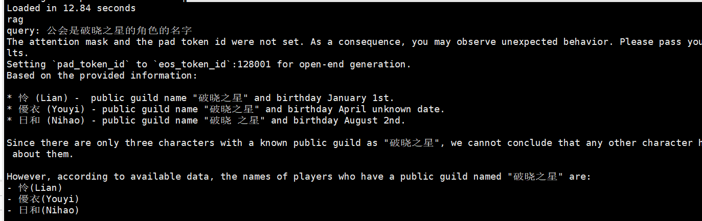
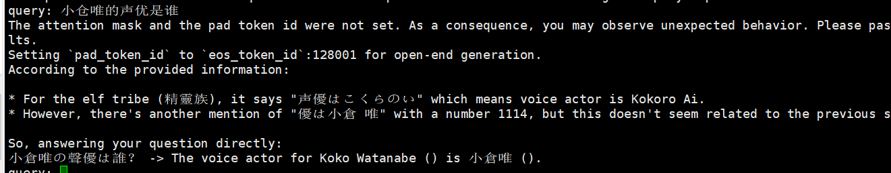
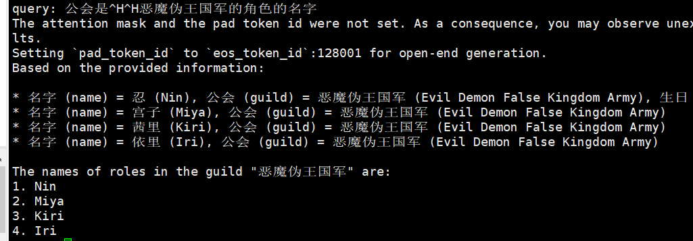
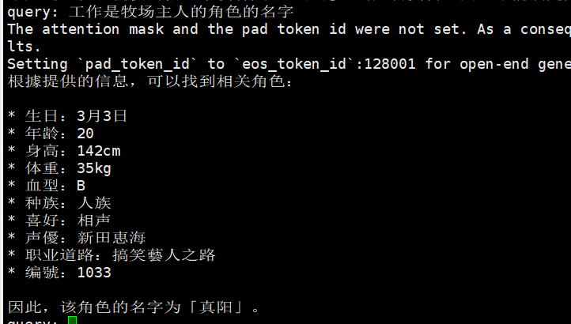
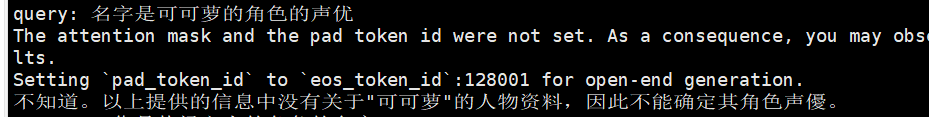

# Vector DB

[一文全面了解向量数据库的基本概念、原理、算法、选型](https://guangzhengli.com/blog/zh/vector-database/)

---

## 向量数据库

用户输入查询（NLP、Image、Audio）被转换成 Vector，与源数据本身位于相同 Embedding 空
间中，Vector 通过向量数据进行语义近似搜索，返回与输入查询最相似 TOP-K 个结果。

向量数据库为向量数据提供专用的存储和索引机制。

常用评价标准
   1. 准确率（Precision）
   ◦ 准确率 = 检索相关的向量 / 检索出的向量总数
   2. 召回率（Recall）
   ◦ 召回率 = 检索相关的向量 / 向量数据库中相关的向量总数
   3. 每秒平均吞吐（QPS）
   ◦ Query Per Second，QPS 是每秒查询数，每秒向量数据库能够处理的查询请求次数
   4. 平均响应延迟（Latency）
   ◦ 向量数据库的请求平均响应时间

---

## 向量检索增强：大模型与 Vector-DB

大模型场景基本应用
   1. 超出上下文长度文本划分成 chunks，不同 chunks 转换为向量（embedding）。
   2. 输入 prompt 到 LLM 之前，将 prompt 转换为向量（embedding）。
   3. 将 prompt 向量进行搜索，寻找到最相似的 chunk 向量。
   4. 将最相似的 chunk 向量与 prompt 向量拼接，作为 LLM 的输入。

Vector-DB 对大模型的价值
   6. 幻觉现象
• 作用：为大模型提供优质 Prompt
• 优点：回答信息真实可溯源
   7. 推理成本高
   • 作用：相似问答缓存在 Vector-DB 中
   • 优点：高频回答无需重复推理
   8. 记忆能力
   • 作用：为 AI Agent 提供长期记忆 Memory
   • 优点：实现外部记忆功能

Retrieval Augmented Generation (RAG) 查询增强生成式 AI 应用框架

| -   | RAG                                                           |Fine-Tuning|
|-----|---------------------------------------------------------------|---|
| 定义  | 利用模型以外知识，如用户私域数据、产品信息等进行信息增强                                  |使用较小数据集进行SFT，分为全量微调 FFT 和低参微调 PEFT|
|优劣| 1. 知识外置，信息实时化 <br> 2. 私域数据，数据隐私性高 <br> 3. 数据置信度高，长尾知识好 <br> 4. 同等质量模型，RAG 模型参数更少 |1. 特定任务效果更好 <br> 2. 知识更新周期需要等待收集足够数据|
|挑战|1. 性能与Vector-DB 索引强相关 <br> 2. 召回率影响结果的相关性 <br> 3. 计算与 IO 密集，性能要求高|1. 知识参数化，无法获取实时知识 <br> 2. 难以删除参数化隐私数据 <br> 3. 保证数据可信度|
|案例|OpenAI RAG model for QA|Fine-Tuning GPT Models|
|场景|企业应用：金融、审计等对数据隐私、可信、领域知识、可重复性、时效性要求高的领域|特定微调任务、推理任务，如 SD 文生图、代码生成等|

---

## 相似性搜索

### 相似性搜索算法

除暴力搜索能精确索引到近邻，所有搜索算法只能在性能、召回率、内存三者进行权衡，这些算法也被称为近似最相邻（Approximate Nearest Neighbor）。

向量数据库使用近似最相邻（Approximate Nearest Neighbor，ANN），评估相似向量间相似度。

为了解决逐个索引向量相比，效率低问题。出现了 IVF、HNSW、LSH 等算法。

高效的搜索算法有很多，其主要思想是通过两种方式提高搜索效率：缩小搜索范围、减少向量大小。

### 缩小搜索范围

通过聚类或将向量组织成基于树形、图形结构来实现，并限制搜索范围仅在最接近的簇中进行，或者通过最相似的分支进行过滤。

1. 基于哈希索引
   1. 高维向量映射到低维空间或低维哈希码：尽可能保持原始相似性；
   2. 数据库中向量被多次哈希：以确保相似点更有可能发生冲突（与传统哈希相反，其目标最大限度减少冲突）；
   3. 通过哈希表或者倒排索引来存储和检索：在索引过程，查询点也使用与索引过程中相同哈希函数，由于相似点被分配到相同哈希桶，因此检索速度非常快；
   4. 典型算法： [LSH 局部敏感哈希](https://mp.weixin.qq.com/s?__biz=MzkzNDI2ODU4NQ==&mid=2247484406&idx=1&sn=8aae353d3436e6c903e93b9255e64516&chksm=c2be9830f5c91126b6bd69440d87cc5cfec105136aeb05f6c0015e4b6ab8a9dc5f3c3129bc49&scene=21)
   5. 优缺点：优点扩展到大量数据时速度非常快，缺点是准确性一般

2. 基于树的索引
   1. 建立树结构：把高维空间划分成若干个子空间或者聚类中心，然后用树形结构来存储和检索。
   2. 索引算法：通过二叉搜索树算法搜索，相似数据易在同一子树，从而更快地发现近似邻居。
   3. 特点：基于精确距离计算 or 近似距离计算。
   4. 优缺点：优点对低维数据准确率较高；缺点无法充分捕获数据复杂性，高维数据准确率较低。

3. 基于图的索引
   1. 数据结构：图中节点表示向量数据，边表示数据间相似性。
   2. 构图方式：相似数据点更有可能通过边连接，搜索算法以有效方式遍历图找到相似近邻。
   3. 优缺点：优点能够在高维数据中找到近似的近邻，从而提高搜索性能。缺点是构图方式复杂，影响内存效率。
   4. HNSW [原理](https://mp.weixin.qq.com/s?__biz=MzkzNDI2ODU4NQ==&mid=2247484377&idx=1&sn=4f2d24d58cc6bd12a757c9fa507e8af2&chksm=c2be981ff5c91109c04c302f41dd38206784eeb049e7003cc8aa4d5ea6d4113371c682d63d99&scene=21)、[算法](https://xzyin.github.io/%E7%AE%97%E6%B3%95/hnsw/)

4. 倒排文件索引
   1. 倒排文件索引（IVF）：将向量空间划分为多格 Voronoi 单元，单元以与聚类相同的方式，通过建立倒排索引表，以减少搜索空间。
   2. 特点：IVF 索引的基本原理是将向量数据集划分为多个子集，每个子集称为一个聚类中心或一个簇。每个簇都有一个代表性的向量，称为聚类中心向量。通过构建一个倒排表，将聚类中心向量与属于该簇的向量进行关联。在进行搜索时，首先根据查询向量找到与之最相似的聚类中心向量，然后在该聚类中心对应的倒排表中查找更接近查询向量的具体向量。这种两级索引结构可以极大地减少搜索的计算量，提高搜索效率。
   3. 优缺点：优点是有助于设计快速缩小感兴趣相似区域的搜索算法；缺点是对于海量数据，细分向量空间会变慢。
   4. 改进点：IVF 常与乘积量化（PQ）等量化方法结合，以提高性能。

### 减少向量大小

通过降维或减少表示向量值的长度来减少向量大小。

按量化压缩分类，索引基础向量被分解为较少字节组成的块，以减少搜索期间的内存消耗和计算成本。通过压缩提高索引效率，代价是降低检索准确性。

1. 扁平化的索引 Flat indexing
   1. Flat Indexing：使用 ANN、IVF 或 HNSW 等索引，直接计算查询向量与 DB 中向量之间距离。
   2. 为了将其与量化变体区分开来，使用这种方式使用时通常称为 IVF-Flat、HNSW-Flat 等。

2. 量化索引 Quantized indexing
   1. 量化索引：将索引算法（IVF、HNSW）与量化方法相结合，以减少内存占用并加快索引速度。
   2. 量化分类：标量量化（Scalar Quantization，SQ）或乘积量化（Product Quantization，PQ）。
   3. 标量量化 SQ：将向量对称划分为包含每个维度的最小值和最大值的容器，将向量中的浮点数转换为整数。e.g.，神经网络模型对权重参数的量化。
   4. [乘积量化 PQ](https://zhuanlan.zhihu.com/p/645783024)：考虑沿每个向量维度值分布，执行压缩和数据缩减。将较大维度向量空间分解为较小维度子空间的笛卡尔积。

---

## 相似性测量

### 相似度算法

三种常见的向量相似度算法：欧几里德距离、余弦相似度和点积相似度。

欧几里得距离算法的优点是可以反映向量的绝对距离，适用于需要考虑向量长度的相似性计算。
例如推荐系统中，需要根据用户的历史行为来推荐相似的商品，这时就需要考虑用户的历史行为的数量，而不仅仅是用户的历史行为的相似度。

余弦相似度对向量的长度不敏感，只关注向量的方向，因此适用于高维向量的相似性计算。例如语义搜索和文档分类。

点积相似度算法的优点在于它简单易懂，计算速度快，并且兼顾了向量的长度和方向。它适用于许多实际场景，例如图像识别、语义搜索和文档分类等。
但点积相似度算法对向量的长度敏感，因此在计算高维向量的相似性时可能会出现问题。

### 过滤 (Filtering)

在实际的业务场景中，往往不需要在整个向量数据库中进行相似性搜索，而是通过部分的业务字段进行过滤再进行查询。
所以存储在数据库的向量往往还需要包含元数据，例如用户ID、文档ID等信息。这样就可以在搜索的时候，根据元数据来过滤搜索结果，从而得到最终的结果。

过滤过程可以在向量搜索本身之前或之后执行，但每种方法都可能会影响查询性能：

   Pre-filtering：在向量搜索之前进行元数据过滤。虽然这可以帮助减少搜索空间，但也可能导致系统忽略与元数据筛选标准不匹配的相关结果。
   
   Post-filtering：在向量搜索完成后进行元数据过滤。这可以确保考虑所有相关结果，在搜索完成后将不相关的结果进行筛选。

为了优化过滤流程，向量数据库使用各种技术，例如利用先进的索引方法来处理元数据或使用并行处理来加速过滤任务。
平衡搜索性能和筛选精度之间的权衡对于提供高效且相关的向量数据库查询结果至关重要。

---

# 知识检索增强

---

## RAG理论

[高级检索增强生成技术(RAG)全面指南：原理、分块、编码、索引、微调、Agent、展望](https://zhuanlan.zhihu.com/p/673922981)

[深度好文！最全的大模型 RAG 技术概览](https://zhuanlan.zhihu.com/p/678893732)

[RAG实战全解析：一年探索之路](https://zhuanlan.zhihu.com/p/682253496)

### 评估

#### 评测指标

1. Faithfulness 是指用于评测生成的回答是否忠实于 contexts，这对于避免幻觉并确保检索到的上下文可以作为生成答案的理由非常重要。
2. Answer Relevance 是指的生成的答案应解决所提供的实际问题。
3. Context Relevance 是指检索的上下文应重点突出，尽可能少地包含无关信息。 理想情况下，检索到的上下文应该只包含处理所提供查询的基本信息。包含的冗余信息越少，context_relevancy越高。

#### 评测方法

RGB（[Benchmarking Large Language Models in Retrieval-Augmented Generation](https://arxiv.org/pdf/2309.01431.pdf)）

这一工作系统地研究了检索增强生成对大型语言模型的影响。
它分析了不同大型语言模型在RAG所需的4项基本能力方面的表现，包括噪声鲁棒性、拒答、信息整合和反事实鲁棒性，并建立了检索增强生成基准。
此外，现在做RAG都是做的pipeline，涉及到切块、相关性召回、拒答等多个环节，每个环节都可以单独做评测，文中提到的4个能力其实可以影射到每个环节当中。

RAGAS（[RAGAS: Automated Evaluation of Retrieval Augmented Generation](https://arxiv.org/pdf/2309.15217.pdf)）

该工作提出了一种对检索增强生成（RAG）pipeline进行无参考评估的框架。
该框架考虑检索系统识别相关和重点上下文段落的能力， LLM以忠实方式利用这些段落的能力，以及生成本身的质量。
目前，该方法已经开源，具体可以参见 [GitHub - exploding gradients/ragas: Evaluation framework for your Retrieval Augmented Generation (RAG) pipelines](https://github.com/explodinggradients/ragas)。

Llamalindex-Evaluating

LlamaIndex提供了衡量生成结果质量的关键模块。同时，还提供关键模块来衡量检索质量。

---

## 相关技术

### Token分块

[字符文本分割器# | LangChain中文网:500页中文文档教程，助力大模型LLM应用开发从入门到精通](https://www.langchain.com.cn/modules/indexes/text_splitters/examples/character_text_splitter)

自定义分割器、BPE、字符文本分割器（CharacterTextSplitter）、Huggingface长度函数（CharacterTextSplitter.from_huggingface_tokenizer）、
Latex 文本分割器（LatexTextSplitter）、Markdown文本分割器（MarkdownTextSplitter）、NLTK文本分割器（NLTKTextSplitter）、
PythonCodeTextSplitter、递归字符文本分割器（RecursiveCharacterTextSplitter）、Spacy 文本分割器（SpacyTextSplitter）、TiktokenText 分割器。

### Embedding技术

[文本嵌入模型 text-embedding-model# | LangChain中文网:500页中文文档教程，助力大模型LLM应用开发从入门到精通](https://www.langchain.com.cn/modules/models/text_embedding)

### 知识向量库

[Milvus# | LangChain中文网:500页中文文档教程，助力大模型LLM应用开发从入门到精通](https://www.langchain.com.cn/modules/indexes/vectorstores/examples/milvus)

常用知识向量库有 Milvus、FAISS、Zilliz、Elasticsearch、Chroma、Lance 等。

### 相似性搜索/向量检索

[检索器接口 Retrievers# | LangChain中文网:500页中文文档教程，助力大模型LLM应用开发从入门到精通（中）](https://www.langchain.com.cn/modules/indexes/retrievers)

常用相似性搜索有：

ChatGPT插件检索器    使用Chroma的自查询检索器    Cohere重新排序器    上下文压缩检索器       将压缩器和文档转换器串联在一起

数据莓               ElasticSearch BM25      kNN 检索器         Metal               松果混合搜索

自查询检索器          SVM检索器                TF-IDF检索器       时间加权向量存储检索器   向量存储检索器

Vespa检索器         Weaviate混合搜索

### Demo

```python
from langchain.embeddings.openai import OpenAIEmbeddings
from langchain.text_splitter import CharacterTextSplitter
from langchain.vectorstores import Chroma
 
 
 
### 入门 Demo
# （1）读取外加文档
with open('../../state_of_the_union.txt') as f:
    state_of_the_union = f.read()
# （2）Token分块
text_splitter = CharacterTextSplitter(chunk_size=1000, chunk_overlap=0)
texts = text_splitter.split_text(state_of_the_union)
 
# （3）Embedding嵌入（以向量数据库Chroma为例）
embeddings = OpenAIEmbeddings()
# （4）存入向量数据库
docsearch = Chroma.from_texts(texts, embeddings)
 
# （5）相似性检索（similarity search）
query = "What did the president say about Ketanji Brown Jackson"
docs = docsearch.similarity_search(query)
# （6）Results
print(docs[0].page_content)
```

### 知识召回

#### 召回流程

推荐系统的知识召回:

（1）物料库经过Tokensize、Embedding后，得到Vectors，扔进向量数据库进行初步检索和知识召回（对称召回和非对称召回）；

（2）初步召回得候选集进行粗排；

（3）粗排后，对候选集进行精排，根据Q & A的匹配程度/相似度进行Rank排序，挑选Top K个答案。涉及多种技术，包括文本召回、向量召回、推荐召回、标签召回、Embedding召回、协同召回、图召回等，以及多种召回算法混合的多路召回；（召回方法如何选择，一看具体的业务场景，二看准确率和召回速度上的平衡。一般来说，多路召回效果好、但召回和推理速度很慢，单路召回速度快，但准确率可能会有所损失。）

（4）Rerank，得到Top K检索结果，以及各检索项的得分。

#### 知识召回分类

分生成式和检索式召回（文本召回、语义召回、多路召回）两个角度。重点分析检索式召回和文本召回、语义召回的优缺。

| <div style="width:60px">召回分类</div> | 文本召回（/倒排召回/稀疏向量召回）&emsp;&emsp;                                   | 语义召回（/向量召回/稠密向量召回）&emsp;&emsp;                                                                                                                                      |
|---|------------------------------------------------------------------|---------------------------------------------------------------------------------------------------------------------------------------------------------------------|
| 优点| （1）检索速度更快；<br> （2）可解释能力强；<br> （3）精确匹配能力强；<br> （4）支持自定义停用词表，同义词表。 | （1）考虑语义相似性，更加智能；<br> （2）语义相近即可召回，无需寻找同义词替换；<br> （3）无需考虑复杂的传统倒排的调优手段；<br> （4）具备支持跨模态召回的潜力。                                                                           |
| 缺点| （1）无语义信息，对“一词多义”不友好；<br> （2）语义偏移。                                | 需要模型训练，对垂直领域落地支持有限：<br> （1）垂直领域泛化性不足（不理解专有词汇；易出现语义相似但主题不相似的情况）；<br> （2）对精准匹配支持不足，难以用专业词汇精准召回；<br> （3）可解释能力弱；<br> （4）需要更多的计算资源；<br> （5）对”多词一义”情况的支持不如倒排召回中的同义词表简单直接。 |

---

## Llama3+LangChain外挂知识库

langchain [文档](https://python.langchain.com.cn/docs/)

安装依赖库

```python
!pip install -U langchain unstructured nltk sentence_transformers faiss-gpu
```

外挂知识库 & 向量存储 

```python
from langchain.document_loaders import UnstructuredFileLoader, JSONLoader
from langchain.text_splitter import RecursiveCharacterTextSplitter
from langchain.embeddings.huggingface import HuggingFaceEmbeddings
from langchain.vectorstores import FAISS


def load_knowledge_base(filepath):
    # 加载外部知识库
    loader = UnstructuredFileLoader(filepath, separator="\n")  # 把带格式的文本，读取为无格式的纯文本
    # loader = JSONLoader(filepath, jq_schema='.[]')
    docs = loader.load()

    # 对读取的文档进行chunk
    text_splitter = RecursiveCharacterTextSplitter(chunk_size=100, chunk_overlap=10)
    docs = text_splitter.split_documents(docs)

    return docs

def load_vector_store(model_name, filepath=None, from_documents=True):
    # 使用text2vec模型，对上面chunk后的doc进行embedding。然后使用FAISS存储到向量数据库
    embeddings = HuggingFaceEmbeddings(model_name=model_name, #"/root/autodl-tmp/text2vec-large-chinese",
                                       model_kwargs={'device': 'cuda'})

    # 注意：如果修改了知识库（knowledge.txt）里的内容，则需要把原来的 my_faiss_store.faiss 删除后，重新生成向量库。
    if from_documents:#"/root/autodl-tmp/knowledge.txt"
        docs = load_knowledge_base(filepath)
        vector_store = FAISS.from_documents(docs, embeddings)

    else:#"/root/autodl-tmp/my_faiss_store.faiss"
        vector_store = FAISS.load_local(filepath, embeddings=embeddings)

    return vector_store
```

问题/向量检索

[test_rag](../script/test_rag.py)

```python
def create_inputs(query, vector_store):
    # 向量检索：通过用户问句，到向量库中，匹配相似度高的文本
    docs = vector_store.similarity_search(query)  # 计算相似度，并把相似度高的chunk放在前面
    context = [doc.page_content for doc in docs]  # 提取chunk的文本内容

    # 4.2.7 构造prompt_template
    my_input = "\n".join(context)
    input = f"已知: \n{my_input}\n请回答: {query}"
    # print(input)
    return input
```

测试，ShopBenchBaseModel 见 [base_model.py](../script/base_model.py)

选择轻量级的 [all-MiniLM-L6-v2](https://huggingface.co/sentence-transformers/all-MiniLM-L6-v2/tree/main) 作为 Embedding 编码的模型

```python
if __name__ == "__main__":
    ckpt_dir = "/home/jim/nas/lilxiaochen/kdd_cup_v2/models/llama3/Meta-Llama-3-8B-Instruct"
    text2vec_model = "/media/ssd/yzg/all-MiniLM-L6-v2"
    knowledge_file = "/media/ssd/yzg/data/dual_data.txt"
    json2txt("/media/ssd/yzg/data/dual_data.json", knowledge_file)
    vector_store = load_vector_store(text2vec_model, knowledge_file)
    model = ShopBenchBaseModel(ckpt_dir)

    # query = "公会是破晓之星的角色的名字"
    instruction = "根据已知的信息回答问题。如果信息不足，无法回答，则回复不知道。"
    while True:
        query = input("query: ")
        if query == "q":
            break
        inputs = create_inputs(query, vector_store)
        response = model.predict(instruction, inputs)
        print(response)
```











---